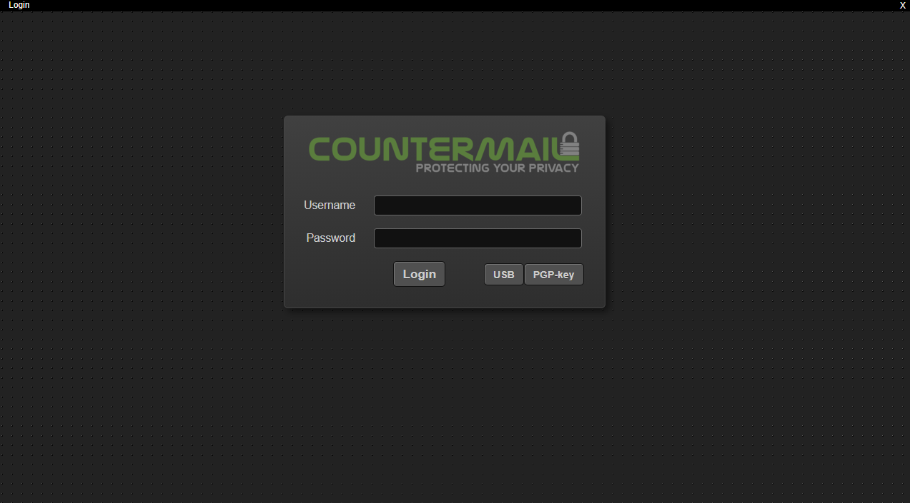
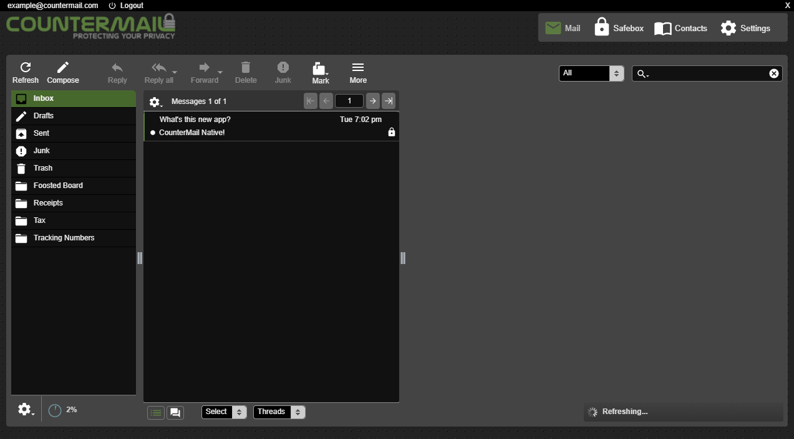

# CounterMail-Native
Just a basic electron app for logging in to [CounterMail](https://countermail.com/) with some quality of life changes too.

# Installing
* Get the a copy of [Node.js](https://nodejs.org)
* Run `npm install -g nativefier`
* Run build.bat

# Why Nativefier?
Because I'm a firm believer in using the simplest tool until I need a specific thing from more complex one. In this case, it'll be when I want to do a mod that involves actual native stuff and not just regular CSS / Javascript mods.
